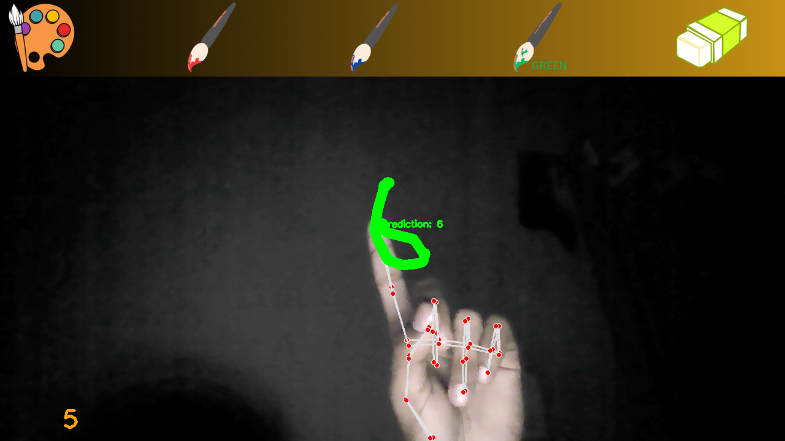

# AI Virtual Painter

## Overview

AI Virtual Painter is a project inspired by [freeCodeCamp.org](https://www.freecodecamp.org/) that leverages artificial intelligence to create stunning digital art. This project allows users to experience a unique blend of creativity and technology, transforming their ideas into digital masterpieces.

## Features

- **AI-Powered Painting:** Utilizes state-of-the-art machine learning models to generate beautiful and artistic digital paintings.
- **Intuitive Interface:** User-friendly interface for an effortless and enjoyable painting experience.
- **Customization Options:** Explore various brushes, colors, and styles to personalize your artwork.
- **Export and Share:** Save your creations and share them with the world.

## Demo

Include a GIF or screenshot to showcase the application in action.

